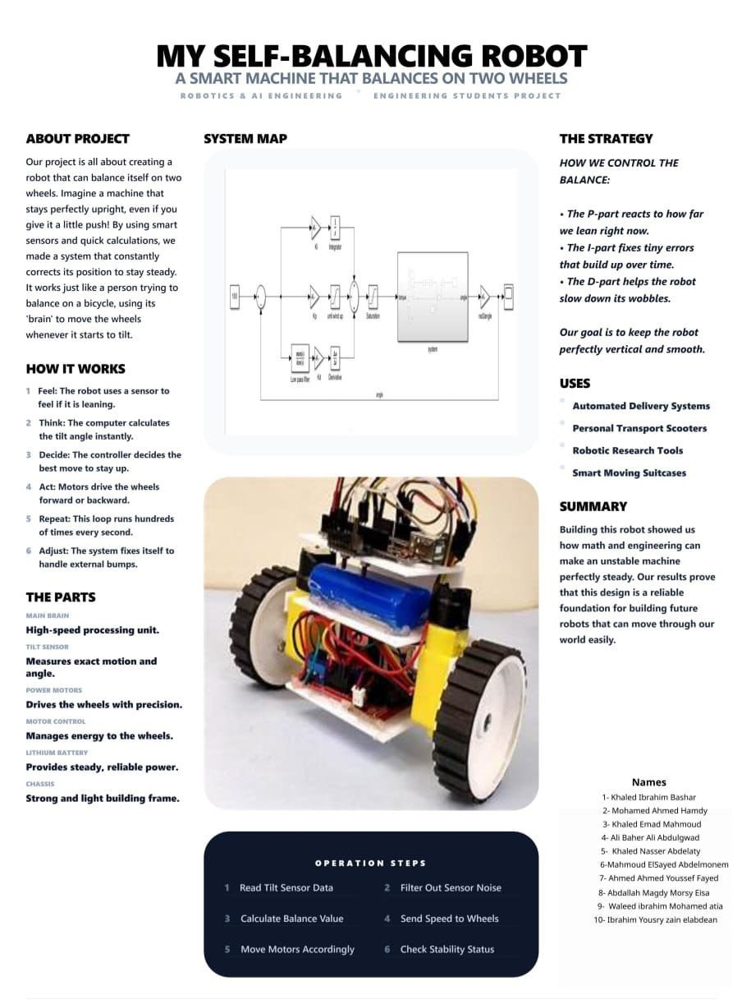

# 🤖 Self-Balancing Robot

A two-wheeled self-balancing robot designed to maintain an upright position using feedback control. The robot continuously measures its tilt angle with an IMU sensor and adjusts the speed and direction of its motors through a PID controller, allowing it to recover from disturbances and remain balanced in real time.



---

## 📖 Overview

The Self-Balancing Robot is an embedded systems and control engineering project that demonstrates the practical implementation of an inverted pendulum control system.

Using sensor data from an IMU, the controller estimates the robot's tilt angle and calculates the appropriate motor response using a PID (Proportional–Integral–Derivative) algorithm. This feedback loop runs continuously, enabling the robot to stabilize itself even when external forces cause it to lean.

The project combines concepts from robotics, control systems, electronics, and embedded programming into a compact autonomous platform.

---

## ✨ Features

- Real-time self balancing
- PID-based feedback control
- IMU sensor angle estimation
- Continuous motor speed adjustment
- Compact two-wheel robot platform
- Easy to modify and expand

---

## 🛠 Hardware Components

- Arduino / ESP32
- MPU6050 IMU Sensor
- DC Gear Motors
- Motor Driver Module
- Lithium Battery
- Two-Wheel Chassis

---

## ⚙️ How It Works

The balancing process follows a continuous control loop:

1. Read the tilt angle from the IMU sensor.
2. Filter and process sensor measurements.
3. Calculate the balancing error.
4. Apply the PID control algorithm.
5. Adjust the motor speed and direction.
6. Repeat the process hundreds of times per second.

---

## 📂 Repository Contents

```
.
├── main.cpp
├── poster.jpg
└── README.md
```

---

## 🚀 Future Improvements

- Bluetooth parameter tuning
- Mobile application support
- Wireless telemetry
- Obstacle avoidance
- Autonomous navigation
- Improved sensor fusion using Kalman filter

---

## 📄 License

This project is intended for educational and academic purposes.
